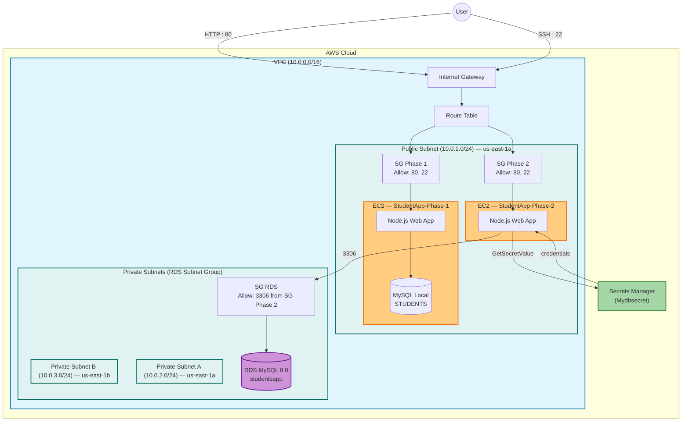

```mermaid
graph TD
    User((User))

    subgraph AWS_Cloud ["AWS Cloud"]
        SecretsManager["Secrets Manager\n(Mydbsecret)"]

        subgraph VPC ["VPC (10.0.0.0/16)"]
            IGW[Internet Gateway]
            RT[Route Table]

            subgraph Public_Subnet ["Public Subnet (10.0.1.0/24) — us-east-1a"]
                sg1["SG Phase 1\nAllow: 80, 22"]
                sg2["SG Phase 2\nAllow: 80, 22"]

                subgraph EC2_Phase1 ["EC2 — StudentApp-Phase-1"]
                    WebApp1[Node.js Web App]
                    DB_Local[(MySQL Local\nSTUDENTS)]
                end

                subgraph EC2_Phase2 ["EC2 — StudentApp-Phase-2"]
                    WebApp2[Node.js Web App]
                end
            end

            subgraph Private_Subnets ["Private Subnets (RDS Subnet Group)"]
                subgraph Private_A ["Private Subnet A (10.0.2.0/24) — us-east-1a"]
                end
                subgraph Private_B ["Private Subnet B (10.0.3.0/24) — us-east-1b"]
                end

                sg_db["SG RDS\nAllow: 3306 from SG Phase 2"]
                RDS[("RDS MySQL 8.0\nstudentsapp")]
            end
        end
    end

    User -- "HTTP : 80" --> IGW
    User -- "SSH : 22" --> IGW
    IGW --> RT
    RT --> sg1
    RT --> sg2
    sg1 --> WebApp1
    sg2 --> WebApp2
    WebApp1 --> DB_Local
    WebApp2 -- "3306" --> sg_db
    sg_db --> RDS
    WebApp2 -- "GetSecretValue" --> SecretsManager
    SecretsManager -- "credentials" --> WebApp2

    classDef vpc fill:#E1F5FE,stroke:#0277BD,stroke-width:2px;
    classDef subnet fill:#E0F2F1,stroke:#00695C,stroke-width:2px;
    classDef ec2 fill:#FFCC80,stroke:#EF6C00,stroke-width:2px;
    classDef rds fill:#CE93D8,stroke:#6A1B9A,stroke-width:2px;
    classDef secrets fill:#A5D6A7,stroke:#2E7D32,stroke-width:2px;

    class VPC vpc;
    class Public_Subnet,Private_Subnets,Private_A,Private_B subnet;
    class EC2_Phase1,EC2_Phase2 ec2;
    class RDS rds;
    class SecretsManager secrets;
```
