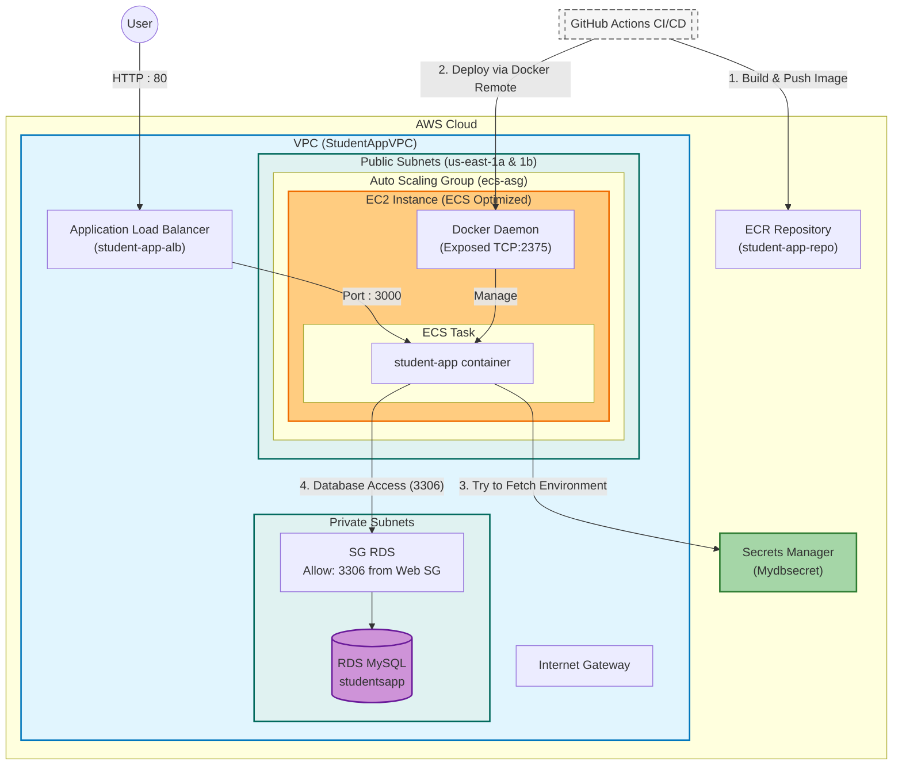

```mermaid
graph TD
    User((User))
    GitHub[[GitHub Actions CI/CD]]

    subgraph AWS_Cloud ["AWS Cloud"]
        ECR["ECR Repository\n(student-app-repo)"]
        SecretsManager["Secrets Manager\n(Mydbsecret)"]

        subgraph VPC ["VPC (StudentAppVPC)"]
            IGW[Internet Gateway]
            ALB["Application Load Balancer\n(student-app-alb)"]

            subgraph Public_Subnets ["Public Subnets (us-east-1a & 1b)"]
                subgraph ASG ["Auto Scaling Group (ecs-asg)"]
                    subgraph EC2_Node ["EC2 Instance (ECS Optimized)"]
                        Docker["Docker Daemon\n(Exposed TCP:2375)"]
                        subgraph ECS_Task ["ECS Task"]
                            App["student-app container"]
                        end
                    end
                end
            end

            subgraph Private_Subnets ["Private Subnets"]
                RDS[("RDS MySQL\nstudentsapp")]
                DB_SG["SG RDS\nAllow: 3306 from Web SG"]
            end
        end
    end

    %% Flows
    User -- "HTTP : 80" --> ALB
    ALB -- "Port : 3000" --> App
    
    GitHub -- "1. Build & Push Image" --> ECR
    GitHub -- "2. Deploy via Docker Remote" --> Docker
    Docker -- "Manage" --> App
    
    App -- "3. Try to Fetch Environment" --> SecretsManager
    App -- "4. Database Access (3306)" --> DB_SG
    DB_SG --> RDS

    %% Styling
    classDef vpc fill:#E1F5FE,stroke:#0277BD,stroke-width:2px;
    classDef subnet fill:#E0F2F1,stroke:#00695C,stroke-width:2px;
    classDef ec2 fill:#FFCC80,stroke:#EF6C00,stroke-width:2px;
    classDef rds fill:#CE93D8,stroke:#6A1B9A,stroke-width:2px;
    classDef secrets fill:#A5D6A7,stroke:#2E7D32,stroke-width:2px;
    classDef cicd fill:#F5F5F5,stroke:#333,stroke-dasharray: 5 5;

    class VPC vpc;
    class Public_Subnets,Private_Subnets subnet;
    class EC2_Node ec2;
    class RDS rds;
    class SecretsManager secrets;
    class GitHub cicd;
```
