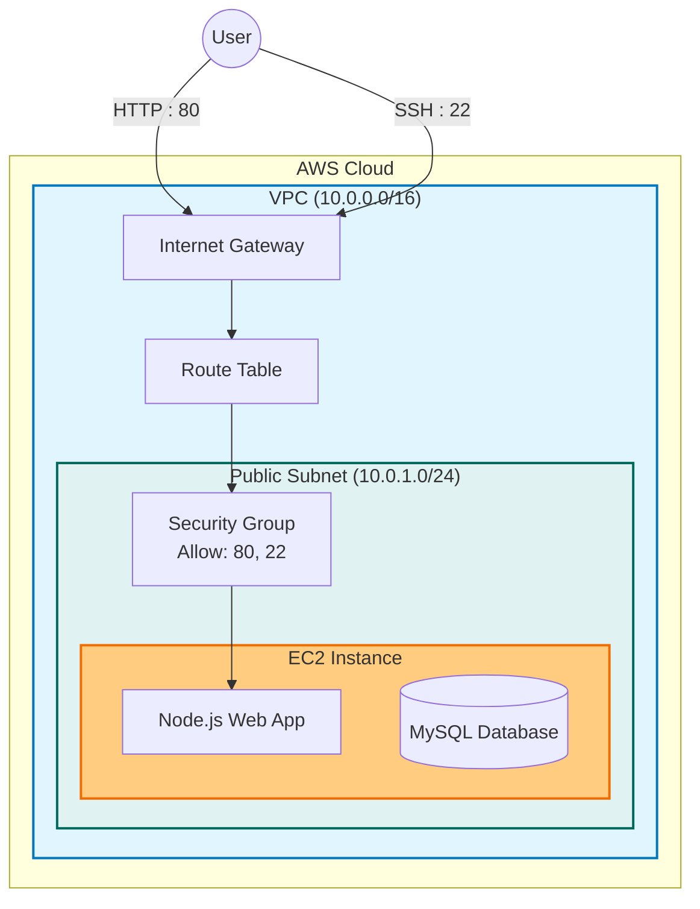

```mermaid
graph TD
    User((User))
    
    subgraph AWS_Cloud ["AWS Cloud"]
        subgraph VPC ["VPC (10.0.0.0/16)"]
            IGW[Internet Gateway]
            RT[Route Table]
            
            subgraph Public_Subnet ["Public Subnet (10.0.1.0/24)"]
                sg["Security Group<br/>Allow: 80, 22"]
                
                subgraph EC2_Instance ["EC2 Instance"]
                    WebApp[Node.js Web App]
                    DB[(MySQL Database)]
                end
            end
        end
    end

    User -- "HTTP : 80" --> IGW
    User -- "SSH : 22" --> IGW
    IGW --> RT
    RT --> sg
    sg --> WebApp
    
    classDef aws fill:#FF9900,stroke:#232F3E,stroke-width:2px,color:white;
    classDef vpc fill:#E1F5FE,stroke:#0277BD,stroke-width:2px;
    classDef subnet fill:#E0F2F1,stroke:#00695C,stroke-width:2px;
    classDef ec2 fill:#FFCC80,stroke:#EF6C00,stroke-width:2px;
    
    class VPC vpc;
    class Public_Subnet subnet;
    class EC2_Instance ec2;
```
